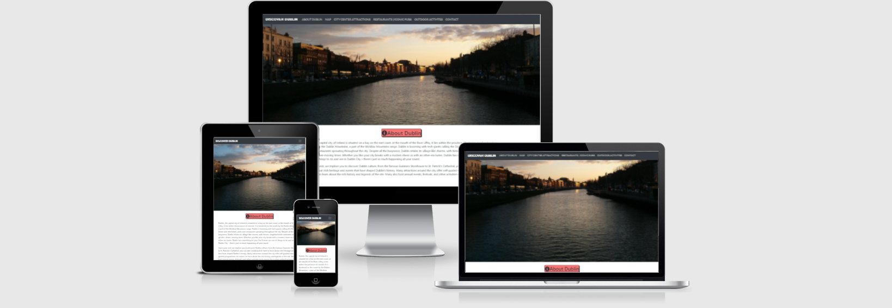

<h1 align="center">Discover Dublin</h1>

[View the live project here.](https://jesson96.github.io/Discover-Dublin/).

This is an interactive website regarding tourist information about the County Dublin, in Ireland. 
The start of this website begins with an image of Dublin city center. 
As the user scrolls down the page, they are greeted with a brief introduction of the city of Dublin, 
followed by two clickable buttons which highlight markers on the Javascript Google maps API 
of tourist attractions and outdoor activites that users may be interested in upon visiting the county of Dublin. 
Underneath the Google Maps API is followed by a carousel of city center attractions, an accordion of restaurant 
and pubs and then another carousel of outdoor activites to do in Dublin. 
Lastly an emailJS API is used for users who have queries about site information.
The user can also access the fixed navigation bar to choose a section of interest to them from attractions, outdoor activites, 
restaurants and good pubs to visit in Dublin.

## User Experience (UX)

#### Project Goals

This website was designed for tourists visiting the county for a weekend or for a short trip who want to enjoy an authentic Dublin experience.
Users of the website will have access to information regarding the best attractions in the city center, a range of outdoor activites, good retaurants and 
great pubs to visit while in Dublin. This website will be beneficial to the user through ease of navigation, efficient rich information regarding Dublin with a visually appealing design.

  ### User Stories

#### First Time User Goals

1. As a first time user, I want readily available content about Dublin that is correct and accurate.
2. As a first time user, I want to be able to access location information of potential places/things to do in Dublin without leaving the website.
3. As a first time user, I want to  be able to contact the website for further information regarding any questions I may have.
4. As a first time user, I want to find outdoor activites, attractions, restaurants and pubs in the city of Dublin.

#### Returning Visitor Goals

1. As a returning visitor, I want to find information about the alternative outdoor activites, attractions, restaurants and pubs in the city of Dublin that the first time user did not already do or visit.
2. As a returning visitor, I want to contact the site owner to enquire about potential activies/places to visit that may be of an interest to the user.

#### Frequent User Goals

1. As a frequent visitor, I want to view alterantive pubs and restaurants that a user has not visitied before.
2. As a frequent visitor, I want to view alteranative attractions and outdoor activites that a user has not seen or done before. 

### Design

#### Colour Scheme
* The two main colours used are white, dark grey, red because it makes content easily readable because of contrasting colours and allows users to understand where a section starts and ends.

#### Typography
* The two main fonts chosen for the website are Lato and Sans-seriff.

#### Imagery
The imagery on the site is important. The site will include  a main hero image which is designed to catch the user's
 attention and entice a user to continue to scroll down the page or use the navigation bar to choose the content they are looking for.
 The carousels also contain 10 high definition photos to entice users to do certain activities or visit certain places.

### Wireframes

* Desktop Page Wireframe - [View](wireframes/desktop-wireframe.pdf)

* Mobile Wireframe - [View](wireframes/mobile-wireframe.pdf)

### Features 
* The website is responsive on all device sizes.
* The website is interactive and allows users to click butons to recieve their desired outcome, submit any queries they may have or view certain places, things to do or images they may be interested in.
* Implement weather forecast over several days and style the weather icons to be more visually appealing. The site owner could not do this due to time constraints.

### Features to be implemented
* In the future, this site should implement the Google Maps radius feature that fetches potential things for a user to visit or do while they are in Dublin giving the users current location.
* A gallery should be included with further images of the city of Dublin.

##  Technologies used

- [HTML5](https://en.wikipedia.org/wiki/HTML5/) - provides the content and structure for my website.
- [CSS3](https://en.wikipedia.org/wiki/CSS/) - provides the styling.
- [Javascript ES6](https://developer.mozilla.org/en-US/docs/Web/JavaScript) - provides interactivity for the wesbite.
- [Bootstrap](https://www.getbootstrap.com/) - used to create the layout of the project.
- [Balsamiq](https://www.balsamiq.com/) - used to create the project's wireframes.
- [Gitpod](https://www.gitpod.io/) - used to develop the website.
- [GitHub](https://www.github.com/) - used to host the project.
- [Google Fonts](https://www.fonts.google.com/) - used to provide the fonts for the website.
- [Font Awesome](https://www.fontawesome.com/) - used the font awesome icons to style the information and the links in the footer, and also to make the Reservation section stand out a small bit.
- [Pixabay](https://www.pixabay.com/) and [Freepik](https://www.freepik.es/) - used to get  images for the project.
- [TinyJPG](https://www.tinyjpg.com/) - used to compress the size of the images.
- [W3schools] (https://www.w3schools.com/) - used to validate certain processes.
- [Stackoverflow] (https://stackoverflow.com/) - 
- [AmIResponsive] (http://ami.responsivedesign.is/) - 
- [CSStricks] (https://css-tricks.com/fluid-width-video/) -
- [Traversy Media] (https://www.youtube.com/watch?v=Zxf1mnP5zcw)
- [Wikipedia] - for most content about Dublin.
- [codepen] - (https://codepen.io/jesson96/pen/WNoqwbq) - gave me the inspiration for my form. Edited to suit this website.
- [emailJS API] - (https://www.emailjs.com/) - used to submit the contact form.
- [Open Weather API] - (https://openweathermap.org/) - used to display weather information above the outdoor activites carousel.
- [Google Maps API] - (https://developers.google.com/maps/documentation/javascript/overview) - used to display location pin drops and content about certain attractions around the city.

## Testing

The testing process can be seen [here](TESTING.md).

## Deployment

### To deploy the project

This project is hosted on GitHub Pages

1. In the menu on the top of the project’s repository in GitHub select Settings.
2. Scroll down to the GitHub Pages section.
3. Inside that section, click on the drop-down menu under Source and select Master Branch.
4. The page will now refresh automatically and the website is now deployed.
5. The link to the webpage is just in the GitHub Pages section down below.

Only one branch has been used for this project.

### To run the project locally

To clone this project from GitHub:

1. Under the repository’s name, click Clone or download.
2. In the Clone with HTTPS section, copy the URL.
3. In the IDE of choice, open Git Bash.
4. Change the current working directory to the location where you want the cloned directory to be made.
5. Type git clone, and then paste the URL copied from GitHub.
6. Press enter and the local clone will be created.

## Credits

### Content 
Some of the text I got for the about me page is from wikipedia and was edited and restructured by me to suit the site. Other information for the carousels was gotten from wikipedia, the shelbourne website [shelbourne](https://www.theshelbourne.com/) and the visit dublin website [Visit Dublin](https://www.visitdublin.com/).

###  Media

The pictures used in this site were obtained from [Pixabay](https://pixabay.com/) and [Freepik](https://www.freepik.es/) as recommended by my mentor as a good source of images.  

###  Acknowledgments

[Precious Ijege](https://www.linkedin.com/in/precious-ijege-908a00168/?originalSubdomain=ng) I'd like to thank Precious for the outstanding mentor guidance and support as well as SVickery(github name) for the inspiration to do a travel website upon seeing his own work.
