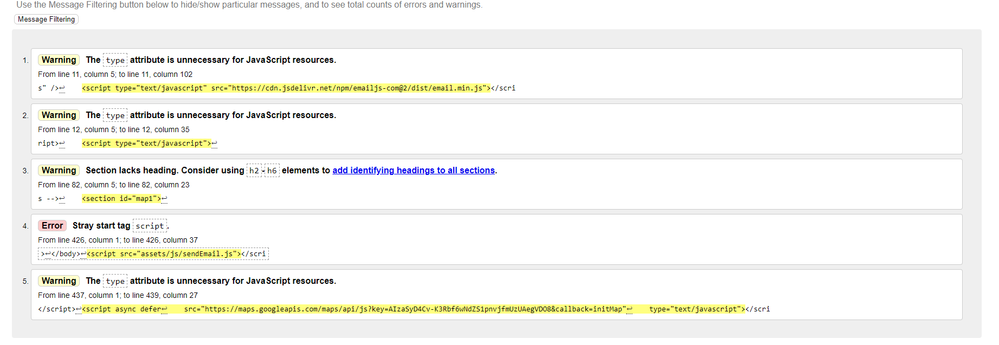
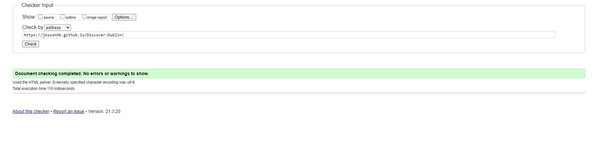
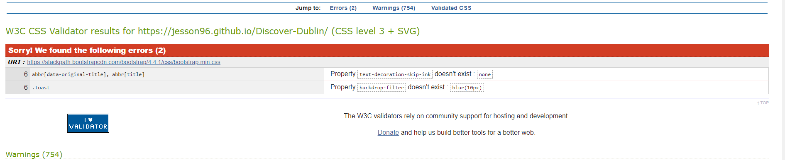
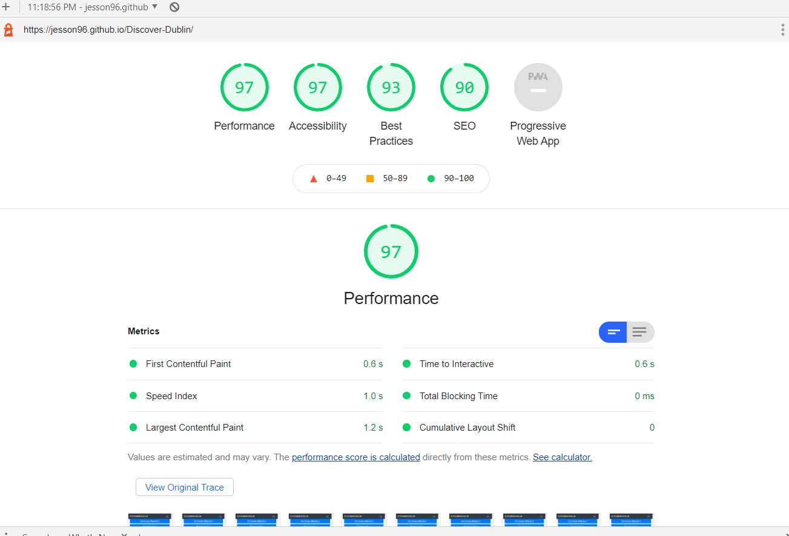
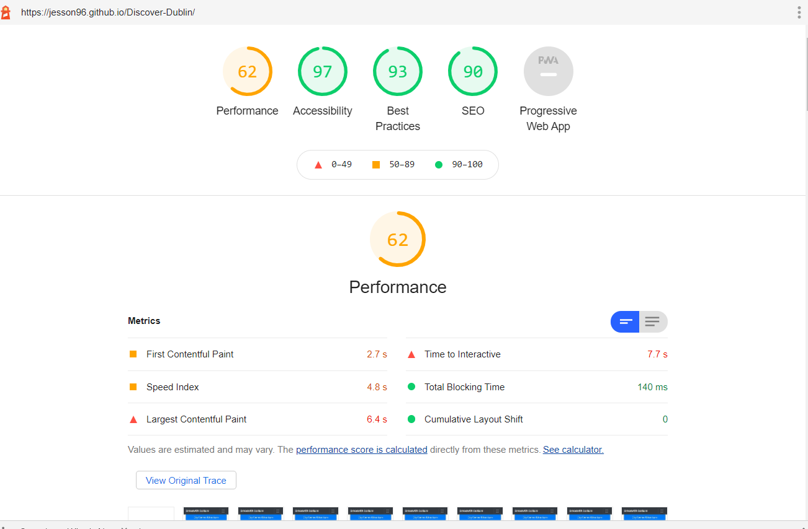

# Testing

## Code validators

* [HTML Validator](https://validator.w3.org/) -  HTML validator found 5 errors mostly to do with script tags.

*  - I removed "type=text/javascript" and got rid of three errors, adding a h2 to the google maps section got rid of one more error and moving a script from the top of the page to the bottom of the body got rid of the last error.

*  - all errors have been fixed.

* [CSS Validator](https://jigsaw.w3.org/css-validator/) - CSS validator found 2 errors on bootstrap that I'm unable to fix because it is an external framework.

* 

#### Lighthouse Google Developer Tools

* Lighthouse Desktop
* 
* Lighthouse Mobile
* 
 
## Testing User stories

#### First Time Visitor Goals

1. As a first time user, I want readily available content about Dublin that is correct and accurate.
    * As a user first enters the site they will be greeted by a navigation bar, a hero-image and an accurate about Dublin section with readily available content on the google maps API for users to click on for their desired information.

2. As a first time user, I want to be able to access location information of potential places/things to do in Dublin without leaving the website.
    * As the user first enters the website, they can scroll down or click on the maps list item in the nav bar to access location information of potential places/things to do in Dublin without leaving the website.

3. As a first time user, I want to  be able to contact the website for further information regarding any questions I may have.
    * A user can click on the contact element in the nav bar or scroll to the bottom of the page to send a query to the site owner regarding information about Dublin using the emailJS api if they wish.

4. As a first time user, I want to find outdoor activites, attractions, restaurants and pubs in the city of Dublin.
    * A user can access this information by using the nav bar or scrolling to their desired content and click buttons to recieve the information of their desired activity, attraction, restaurant or pub.

#### Returning Visitor Goals

1. As a returning visitor, I want to find information about the alternative outdoor activites, attractions, restaurants and pubs in the city of Dublin that the first time user did not already do or visit.
    * A user can find information about the alternative outdoor activites, attractions, restaurants and pubs in the city of Dublin that the first time user did not already do or visit by using different parts of the website that a user may not have used before.

2. As a returning visitor, I want to contact the site owner to enquire about potential activies/places to visit that may be of an interest to the user.
    * A user can click on the contact element in the nav bar or scroll to the bottom of the page to send a query to the site owner regarding information about Dublin using the contact form at the bottom of the page.

#### Frequent User Goals

1. As a frequent visitor, I want to view alterantive pubs and restaurants that a user has not visitied before.
    * A user can find information about the alternative restaurants and pubs in the city of Dublin that a user did not already do or visit by using different parts of the website that a user may not have used before.

2. As a frequent visitor, I want to view alteranative attractions and outdoor activites that a user has not seen or done before.
    * A user can find information about the alternative attractions and outdoor activites in the city of Dublin that a user did not already do or visit by using different parts of the website that a user may not have used before

## Responsiveness

* To test the responsiveness of the site I used [Chrome DevTools](https://developers.google.com/web/tools/chrome-devtools) on a number of devices and I also further checked responsivenss on [Responsive Design Checker](https://www.responsivedesignchecker.com/). 

## Bugs

* Carousel text content is not consistently in the same position on small devices and some medium devices.
* The weather API could be ambigous to the user because of it's size and limited capability.